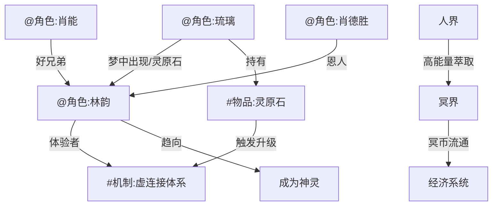

# 全景索引

## 实体关系图谱

## 实体清单

### 角色
- [@角色:林韵] — 虚连接体系的核心体验者，28岁上班族，左腿残疾后因虚连接恢复
- [@角色:琉璃] — 林韵梦中呼唤的名字，8年感情，半透明泛微光形态出现
- [@角色:肖能] — 林韵十多年好兄弟，肖势集团继承人
- [@角色:肖德胜] — 肖能之父，肖势集团掌舵人

### 势力
- [待Ag2-NWB填充 — 需人类确认势力设定]

### 底层机制
- [#机制:虚连接体系] — 灵魂与肉体形成不稳定连接状态，详见 `底层机制/虚连接体系.md`

### 物品
- [#物品:灵原石] — 启动真正虚连接的核心道具，详见 `物品/灵原石.md`

### 剧情事件
- #剧情事件:故事开端 — 林韵半睡半醒状态下首次触碰灵体，详见 `剧情事件/故事开端.md`

## 因果链
- [待Ag3-NWB填充：记录关键因果链和叙事锚点]
