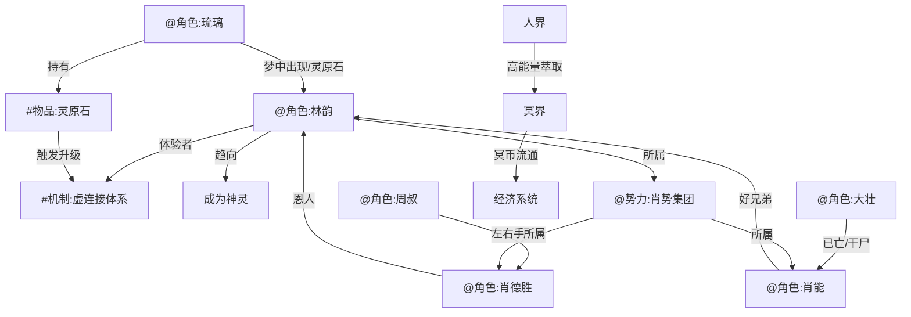

# 全景索引

## 实体关系图谱

## 实体清单

### 角色
- [@角色:林韵] — 虚连接体系的核心体验者，28岁上班族，左腿残疾后因虚连接恢复，所属 [@势力:肖势集团]
- [@角色:琉璃] — 林韵梦中呼唤的名字，8年感情，半透明泛微光形态出现，灵体状态
- [@角色:肖能] — 林韵十多年好兄弟，[@势力:肖势集团] 继承人
- [@角色:肖德胜] — 肖能之父，[@势力:肖势集团] 掌舵人
- [@角色:周叔] — 肖德胜左右手，黑黑瘦瘦戴眼镜
- [@角色:大壮] — 林韵朋友，生日派对参与者，已亡（干尸，有般若纹身）

### 势力
- [@势力:肖势集团] — 商业集团，肖德胜掌舵，肖能继承人，林韵所在公司

### 底层机制
- [#机制:虚连接体系] — 灵魂与肉体形成不稳定连接状态，详见 `底层机制/虚连接体系.md`

### 物品
- [#物品:灵原石] — 启动真正虚连接的核心道具，[@角色:琉璃] 持有并给予 [@角色:林韵]，详见 `物品/灵原石.md`

### 剧情事件
- #剧情事件:故事开端 — 林韵半睡半醒状态下首次触碰灵体，详见 `剧情事件/故事开端.md`
- #剧情事件:12人变干尸 — 第002章，林韵生日派对次日，12位朋友全部变成干尸，详见 `剧情事件/12人变干尸.md` [待Ag4-NWB提取]

## 因果链（初步推演）

### 因果链1：虚连接触发
- **因**: 林韵酒后进入贴有符箓封条的房间睡觉
- **果**: 半睡半醒状态下灵魂与肉体形成初步虚连接
- **后续**: 可触碰灵体（[@角色:琉璃]）

### 因果链2：身体恢复
- **因**: 虚连接形成，灵魂与肉体同时强化
- **果**: 林韵左腿残疾奇迹般恢复
- **后续**: 暗示虚连接对肉体的强化效果

### 因果链3：12人变干尸
- **因**: [待揭示 — 可能与虚连接、般若纹身、或肖能别墅的秘密有关]
- **果**: 12位朋友全部一夜变成干尸
- **疑点**: 为何只有大壮有般若纹身？其他人是否也有？

### 因果链4：琉璃出现
- **因**: [@角色:林韵] 虚连接初步形成，可接触灵体
- **果**: [@角色:琉璃] 在梦境/虚连接状态中出现，给予 [#物品:灵原石]
- **后续**: 待第003章及后续展开

---
> 因果链由 Ag2-NWB 初步推演，待 Ag3-NWB 补充完整叙事锚点。
